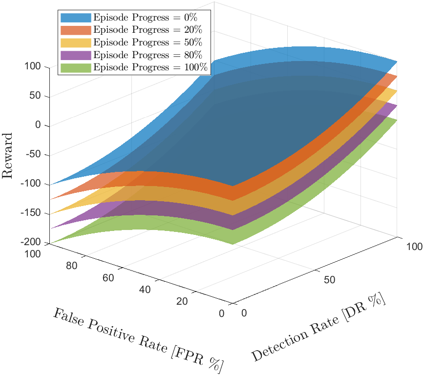

# Patient-adaptive Objective Response Detection <br> using Reinforcement Learning
Alexandre Gomes Caldeira and Leonardo Bonato Felix <br> [See our 5 min pitch-like abstract](https://drive.google.com/file/d/1je-GIWY3jqOzrMXGR6Ksd4slGlTzOSmh/view?usp=sharing)

> **ABSTRACT:** <div style="font-size:0.7em; text-align: justify"> In objective response detection (ORD) based on electroencephalograms (EEGs), different methods have been developed to detect brain responses to stimuli. Most rely on statistical hypothesis testing to objectively detect stimuli-induced responses, such as in Auditory Steady State Response (ASSR) detection. However, existing methods often require long test durations or assumptions about signal-to-noise ratios (SNR) and sample sizes, which can limit their practicality. To address these limitations, this paper introduces a novel approach to ASSR ORD using Reinforcement Learning (RL) methods, and a model is presented and tested. In both simulated and experimental data, the RL model is shown to enable online optimization of false positive rates while maintaining detection rates similar to other published methods, thereby custom-tailoring detectors to patients during exams or Brain-Computer Interface use. The potential of RL for enhancing ORD methods for any evoked response detection is highlighted and avenues for further research in this area are suggested. All the source code for replicating or improving upon these findings are made openly available online, and experimental data is accessible upon request to the authors. </div>

**See our Python implementation comparing Deep Reinforcement Learning approaches:**
[https://github.com/Alexandre-Caldeira/drl-ord/](https://github.com/Alexandre-Caldeira/drl-ord/)

This work is licensed under [LGPL-2.1](https://choosealicense.com/licenses/lgpl-2.1/).
<br>Sourcecode will be improved upon continuously.

## Citation

Like what you see? Cite us!

```
@article{caldeira2024,
  title={Patient-adaptive Objective Response Detection using Reinforcement Learning},
  author={Caldeira, Alexandre and Felix, Leonardo},
  journal={(Accepted for publication) Anais do XXIX CBEB, 2024 – Ribeirão Preto, SP.},
  year={2024}
}
```

## Suggestions for collaboration:

**Curious of how well our framework fits your problem?** <br>
**Contact `eegcal@gmail.com` if interested to work on any of these promising topics:**

  - **Faster patient-adaptive Brain-Computer Interfaces**
  - **Optimized clinical testing and diagnosis**  
  - **Improved prostetic technology with RL** 
  - **Physics-Informed Machine Learning**  
  - **Explainable reinforced decisions**  
  - **Optimized RL and DRL models**

The approach studied in this paper is focused in determining the main characteristics of the Reinforcement Learning solution to the ASSR ORD problem. In that sense, a direct, detection-focused methodology was proposed but there are useful variations to be tested and promising improvements to be researched. Namely, the problem statement can be changed in order to make the agent only be allowed only one detection for the whole episode. This is known as a single-shot detector and is widely used in classic hypothesis test ORDs. Another useful variation is to use a large set of windows as a single state, which reduces the amount of interactions per episode but in return can improve the relevance of the ORDs since they will use a larger sample size at each decision, hopefully leading to more accurate state representation. 

Improvements are also expected if more recent RL methods are used - such as Double Deep Q-Networks and ActorCritic - given their ability to handle continuous inputs and capacity to outperform tabular Q-Learning methods shown in the literature. Other potential branches of research for improving this method can focus on other methods to represent the EEG state, using entropy, correlation, other coherence measurements, SNR estimation and other metrics derived from the plethora of research conducted in the time and frequency domain for evoked response detection. 

Another possible adaptation to the method is adding a third action related to detecting noise, in order to measure False Negatives and True Negatives and further refine the learning towards better agents. Simulations can also be more representative of true data if SNR levels are sampled randomly or modified based on some function of time, to better represent the non stationary aspect of problem. 

Finally, this work focuses its premises in simulating signals that behave similarly to EEG in ASSR detection exams, since the goal was to validate in experiments of this kind. However, notice that the framework proposed here can be easily adapted to the detection of other evoked responses. With this paper, we hope to direct the attention of researchers to the advantages of online optimization with Reinforcement Learning, which may be an important breakthrough for improving solutions to different problems in personalized medicine.

## 0. State representation 

Visit script in ./sourcecode/exp_data to replicate this figure: 

> Fig. 3: (a) The discretized states, represented in time for different frequencies - colored blue if stimulation is absent and red if present for the given frequency.

> This requires access to the database, contact Tiago Zanotelli if needed.


## 1. Simulation script and result examples
> Also, check ./sourcecode/validate_rlord_gen_states to test out different SNR

Visit script in ./sourcecode/save_results to replicate this figure:

> Fig. 1: A pure tone stimulus is the theoretical detectable signal, which has noise added to it at 5 SNR, resulting in a simulated EEG measurement.


> Fig. 2: The simulated signals in Fig. 1 are shown in the frequency domain, and the stimulation frequency is shown in red for the noise and measurement spectra.

## 2. Reward shaping script and result

Visit script in ./sourcecode/ to replicate this figure:

> Fig. 3: (b) A smooth reward function is proposed based on the False Positive Rate, Detection Rate (True Positive) and Episode Progress. Notice that faster, correct detection tends to yield positive rewards whereas longer episodes and detection at incorrect states return more negative rewards, reinforcing true positives.

## 3. Training and testing on simulated data

Visit script in ./sourcecode/save_results to replicate this figure:

> Fig. 4: (a) After each 5 training episodes, 100 tests are conducted and the average results are shown in blue. In orange, the moving mean demonstrates the agent learning, resulting in better detection rate (DR) and false positive rate (FPR). 

## 4. Testing pretrained agent on ASSR experiment

Visit script in ./sourcecode/exp_data to replicate this figure: 

> Fig. 4: (b) Experimental ORD in ASSR using RL to optimize detection and false positive rates for a patient is demonstrated. On the first 200 seconds (windows), agent’s adaptation to the patient is observed as FPR and DR optimization.
> This requires access to the database, contact Tiago Zanotelli if needed.

## 5. Extra comments that did not fit in the paper

The publication is limited to 6 pages, therefore also requiring focus on the most important aspects of the contributinos. In this section I provide some other tests, adjustment and hypothesis I tested for RL ORD that are interesting but not as important as the key findings in the main document.

### 5.1. Longer training does not improve final FPR
It is intuitive to think that longer training would improve final FPR and DR even for very low SNR (-20, -15...) but even for -6 SNR the test results show that the agent plateus. This means that low FPR in low SNR requires: (I) more resolution to improve agent's capacity of distinguishing states as stimulus or noise; (II) other algorithms for Reinforcement Learning that accept continous states; (III) more states based on difference evoked response metrics that are more robust to noise.

### 5.2. Training on multiple frequencies is slower and analogous to single-frequency training
Using multiple frequencies for training means the agent will visit more states for each window of detection. Therefore, training (and testing!) will yield a more accurate mean DR and FPR, but will also be much slower because of the higher computational cost (at least in my original, first draft implementation). When trained in multiple frequencies or only one, the resulting Q-tables were applied to experimental data and yielded the same results! This is may be experimental bias, but may also mean that the training visit the same states for a given SNR despite the multiple stimulation frequencies, which would explain the agent achieving the same results (notice that spectral leakage can be simulated using multpliple stimulation frequencies, therefore it was worth trying). In another perspective, this result may only have happened because the visited states are identical AFTER discretization, and different results could be seen for Deep RL agents.

### 5.3 Training metrics are much noisier than test results because of greedy action selection
During training, DR and FPR stagnate at about 55% and 45% respectively. However, when training is paused and tests are applied (epsilon-greedy is changed to greedy action selection), convergent results from Figures in  past sections are seen. This means that training results are more conservative than test results, and therefore tests results should be regarded as more trustworthy.


### 5.3. Accumulating the ORD over time may be useful
Other methods for ORD such as the Convolutional Group Sequential Testing uses a summary statistic that "accumulates" the ORD values into a single distribution in order to detect responses or even reject the possibility of detection for the given experiment. This can be applied also for Reinforcement Learning agents, if provided the correct states.

### 5.4. Other instances of experimental results
> To be added later (already checked and are analogous to the submitted results).
